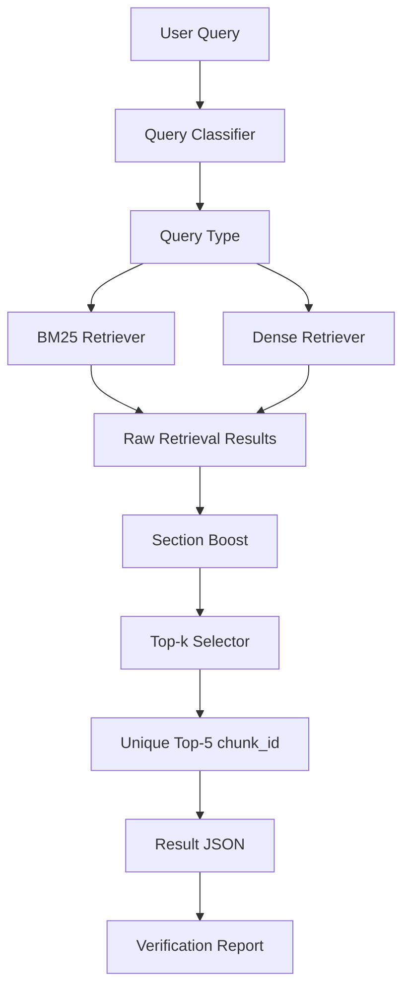

# Fair Decision RAG

공정거래위원회 공개 의결서 데이터를 대상으로, 사용자 질문과 관련된 근거 chunk를 검색하고 **중복 없는 기존 `chunk_id` Top-5**를 반환하는 로컬 RAG 검색 모듈입니다.

이 프로젝트는 외부 API 호출 없이 동작하는 검색 중심 RAG 모듈을 목표로 합니다. 질문 유형을 분류하고, BM25 검색과 Dense Retrieval 결과를 활용하며, 의결서의 `section_type` 정보를 기준으로 검색 결과를 보정해 더 적절한 근거 chunk를 선택합니다.

---

## 1. Project Goal

사용자가 공정거래 의결서 관련 질문을 입력하면, 시스템은 공개본 데이터에 존재하는 기존 `chunk_id` 중에서 질문과 관련된 **중복 없는 chunk_id 5개**를 반환합니다.

최종 목표는 다음과 같습니다.

```text
사용자가 공정거래 의결서 관련 질문을 입력하면,
시스템은 30초 이내에 공개본 데이터에 존재하는
중복 없는 관련 chunk_id 5개와 해당 근거에 기반한 답변을 반환한다.
```

---

## 2. Project Rules

이 프로젝트는 다음 조건을 기준으로 구현합니다.

| Rule | Description |
|---|---|
| 외부 API 호출 없음 | OpenAI API 등 외부 LLM API를 사용하지 않음 |
| 모델 학습 없음 | 별도 모델 학습 없이 retrieval inference 중심으로 구현 |
| 기존 chunk_id 유지 | 공개본 데이터에 존재하는 기존 chunk_id를 그대로 사용 |
| Top-5 반환 | 최종 결과는 정확히 5개의 chunk_id 반환 |
| 중복 제거 | 같은 chunk_id가 중복 반환되지 않도록 처리 |
| 근거 기반 응답 | 검색된 chunk의 section_type, score, text를 함께 확인 가능 |
| 로컬 실행 | GitHub에 공개된 코드와 샘플 데이터로 로컬 실행 가능 |

---

## 3. Key Features

- 공정거래 의결서 질문 유형 분류
- BM25 기반 키워드 검색
- Dense Retrieval 기반 의미 검색
- section_type 기반 검색 결과 boost
- query_type별 section 가중치 적용
- 중복 없는 Top-5 chunk_id 선택
- 기존 공개본 chunk_id 유지
- 결과 JSON 저장
- 검색 결과 검증 스크립트 제공
- 외부 API 없이 로컬 실행

---

## 4. Current Implementation Scope

현재 저장소는 RAG 전체 서비스 중 **검색 모듈과 검증 모듈**을 중심으로 구현되어 있습니다.

구현된 범위:

```text
질문 입력
→ 질문 유형 분류
→ BM25 검색
→ Dense Retrieval
→ section_type 기반 boost
→ 중복 없는 Top-5 chunk 선택
→ 결과 JSON 저장
→ 검증 리포트 생성
```

현재 단계에서는 외부 LLM을 사용한 최종 답변 생성보다, **질문과 관련된 근거 chunk를 안정적으로 찾고 검증하는 구조**에 집중했습니다.

---

## 5. Retrieval Flow

```text
User Query
   ↓
Query Classifier
   ↓
Query Type
   ↓
BM25 Retriever / Dense Retriever
   ↓
Section Boost
   ↓
Top-k Selector
   ↓
Unique Top-5 chunk_id
   ↓
Result JSON
```

---

## 6. Architecture



---

## 7. Query Type Classification

사용자 질문은 키워드 기반으로 유형을 분류합니다.

예시:

| Query | Query Type |
|---|---|
| 이 사건 과징금은 얼마야? | penalty |
| 어떤 법 조항이 적용됐어? | law |
| 피심인은 어떤 명령을 받았어? | order |
| 위반 행위의 이유는 뭐야? | reasoning |
| 사건 사실관계를 알려줘 | fact |
| 전체 내용을 요약해줘 | summary |

질문 유형은 이후 section boost에 사용됩니다.

---

## 8. Section Boost

의결서 chunk는 `section_type`을 가집니다.  
질문 유형과 section_type이 잘 맞을수록 검색 결과의 점수를 보정합니다.

예:

```text
query_type = penalty
section_type = penalty
→ 높은 boost 적용
```

```text
query_type = penalty
section_type = fact
→ 낮은 boost 적용
```

이 구조를 통해 단순 유사도 점수만 사용하는 것이 아니라, 의결서의 문서 구조를 반영해 더 적절한 근거를 선택합니다.

---

## 9. Example Result

실행 명령:

```powershell
python -m src.retrieval.day10_a_runner
```

예시 출력:

```json
{
  "query": "이 사건 과징금은 얼마야?",
  "query_type": "penalty",
  "matched_keywords": [
    "과징금",
    "얼마"
  ],
  "top5_chunk_ids": [
    "case_001_chunk_003",
    "case_001_chunk_005",
    "case_001_chunk_002",
    "case_001_chunk_001",
    "case_001_chunk_004"
  ],
  "top5_results": [
    {
      "rank": 1,
      "chunk_id": "case_001_chunk_003",
      "section_type": "penalty",
      "score": 6.8,
      "section_boost": 1.65,
      "boosted_score": 11.22,
      "text": "피심인에게 과징금 1억 원을 부과한다."
    }
  ]
}
```

결과는 다음 경로에 저장됩니다.

```text
outputs/results/day10_a_sample_result.json
```

PowerShell에서 한글이 깨져 보일 경우 아래 명령으로 확인합니다.

```powershell
Get-Content outputs\results\day10_a_sample_result.json -Encoding UTF8
```

---

## 10. Project Structure

```text
fair-decision-rag/
├─ README.md
├─ requirements.txt
├─ main.py
├─ data/
├─ docs/
├─ indexes/
├─ outputs/
│  └─ results/
│     ├─ day10_a_sample_result.json
│     ├─ day10_bm25_batch_results.json
│     ├─ day10_bm25_top5.json
│     ├─ day10_verification_report.json
│     ├─ day11_dense_top5.json
│     ├─ day11_dense_verification_report.json
│     └─ day12_a_dense_*.json
└─ src/
   ├─ __init__.py
   ├─ query_classifier.py
   ├─ data/
   └─ retrieval/
      ├─ __init__.py
      ├─ bm25_retriever.py
      ├─ dense_retriever.py
      ├─ section_boost.py
      ├─ topk_selector.py
      ├─ query_classifier.py
      ├─ day10_a_runner.py
      ├─ day10_bm25_pipeline.py
      ├─ day10_batch_test.py
      ├─ day10_verify_results.py
      ├─ day11_dense_pipeline.py
      ├─ day11_verify_dense.py
      ├─ test_day10_a_pipeline.py
      ├─ test_day12_a_boost.py
      └─ test_query_boost.py
```

---

## 11. Core Modules

| File | Role |
|---|---|
| `src/retrieval/query_classifier.py` | 질문 키워드 기반 query_type 분류 |
| `src/retrieval/bm25_retriever.py` | BM25 기반 키워드 검색 |
| `src/retrieval/dense_retriever.py` | Dense Retrieval 기반 의미 검색 |
| `src/retrieval/section_boost.py` | query_type과 section_type 기반 score boost |
| `src/retrieval/topk_selector.py` | 중복 없는 Top-k chunk_id 선택 |
| `src/retrieval/day10_a_runner.py` | 질문 분류 + section boost 샘플 실행 |
| `src/retrieval/day10_bm25_pipeline.py` | BM25 검색 pipeline |
| `src/retrieval/day11_dense_pipeline.py` | Dense Retrieval pipeline |
| `src/retrieval/day10_verify_results.py` | 검색 결과 검증 리포트 생성 |
| `src/retrieval/day11_verify_dense.py` | Dense 결과 검증 리포트 생성 |

---

## 12. Installation

```powershell
pip install -r requirements.txt
```

---

## 13. How to Run

프로젝트 루트에서 실행합니다.

```powershell
python -m src.retrieval.day10_a_runner
```

주의: 아래 방식은 import path 문제로 실행하지 않습니다.

```powershell
python src/retrieval/day10_a_runner.py
```

이 프로젝트는 `src` 패키지 import 구조를 사용하므로 `python -m` 방식으로 실행해야 합니다.

---

## 14. Output Files

주요 결과 파일은 `outputs/results/`에 저장됩니다.

| File | Description |
|---|---|
| `day10_a_sample_result.json` | 질문 분류 + section boost 샘플 결과 |
| `day10_bm25_batch_results.json` | BM25 batch 검색 결과 |
| `day10_bm25_top5.json` | BM25 기반 Top-5 결과 |
| `day10_verification_report.json` | BM25 결과 검증 리포트 |
| `day11_dense_top5.json` | Dense Retrieval 기반 Top-5 결과 |
| `day11_dense_verification_report.json` | Dense 결과 검증 리포트 |
| `day12_a_dense_*.json` | Dense + boost 테스트 결과 |

---

## 15. Verification Checklist

검색 결과는 다음 기준으로 확인합니다.

```text
1. top5_chunk_ids가 정확히 5개인가?
2. chunk_id가 중복되지 않는가?
3. 기존 공개본 데이터에 존재하는 chunk_id인가?
4. query_type과 관련된 section_type이 상위에 오는가?
5. 결과 JSON에 rank, chunk_id, section_type, score, boosted_score, text가 포함되는가?
```

---

## 16. Why This Project Matters

공공문서 기반 RAG 시스템에서는 단순히 유사한 문장을 찾는 것만으로는 충분하지 않습니다.

공정거래 의결서는 사실관계, 판단 이유, 법 조항, 시정명령, 과징금 등 section별 역할이 다릅니다. 사용자의 질문이 “과징금”을 묻는 경우에는 penalty section이 더 중요하고, “적용 법 조항”을 묻는 경우에는 law article section이 더 중요합니다.

따라서 이 프로젝트에서는 질문 유형을 먼저 분류하고, section_type 정보를 활용해 검색 결과를 보정하는 구조를 적용했습니다.

---

## 17. Limitations

현재 구현은 로컬 검색 모듈 중심이며, 다음 한계가 있습니다.

- 실제 대규모 공개 의결서 전체 데이터 적용 전 단계
- 외부 LLM 기반 답변 생성은 포함하지 않음
- 질문 유형 분류가 규칙 기반이므로 복잡한 표현에는 한계가 있음
- BM25와 Dense Retrieval 결과를 완전한 hybrid rank fusion으로 통합하는 단계는 추가 개선 필요
- 운영 환경 배포, API 서버, UI는 아직 포함하지 않음

---

## 18. Future Improvements

- 실제 공개본 의결서 데이터 확장
- BM25 + Dense Retrieval hybrid rank fusion 고도화
- Section-aware Router 개선
- Top-5 chunk_id validator 강화
- Grounded Answer Builder 추가
- Streamlit 또는 FastAPI API 연결
- 검색 품질 평가 지표 추가
- 처리 시간 측정 및 30초 이내 응답 검증
- 배포 가능한 로컬 inference 패키지 구조 정리

---

## 19. Portfolio Summary

Fair Decision RAG는 공정거래위원회 공개 의결서 데이터를 대상으로 질문 유형 분류, BM25 검색, Dense Retrieval, section boost를 적용해 중복 없는 기존 chunk_id Top-5를 반환하는 로컬 RAG 검색 모듈입니다.

단순 유사도 검색이 아니라, 질문 유형과 의결서 section_type을 함께 고려해 근거 chunk의 우선순위를 조정했습니다. 이를 통해 공공문서 RAG에서 중요한 `chunk_id` 기반 evidence trace와 검색 결과 검증 흐름을 구현했습니다.
