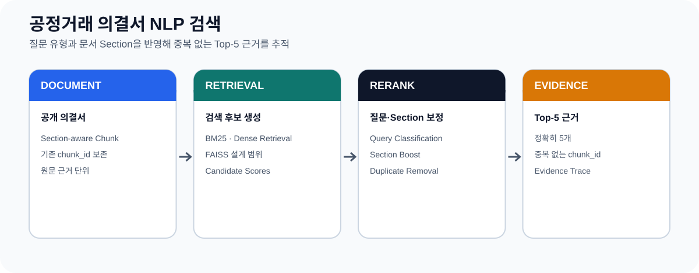
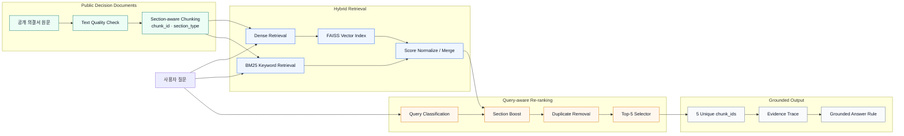

# 공정거래 의결서 NLP 검색

**저장소 ID:** `fair-decision-rag`

> **공정거래위원회 공개 의결서에서 질문과 관련된 근거 구간을 검색하고, 중복 없는 Top-5 `chunk_id`로 추적할 수 있도록 설계한 문서 검색형 RAG 프로젝트**

<p>
  
  
  
  
  
</p>

<p align="center">
  
</p>

[GitHub Profile](https://github.com/lightleaping)

---

## Problem → Work → Evaluation

| Problem · 왜 필요한가 | Work · 어떻게 해결했는가 | Evaluation · 무엇으로 검증했는가 |
|---|---|---|
| 긴 의결서에서 관련 문장을 찾더라도 출처 구간이 불명확하거나 유사 결과가 중복되면 답변 근거를 검토하기 어렵습니다. | 질문 유형을 분류하고, BM25·Dense Retrieval 결과에 문서 Section 정보를 반영한 뒤 중복을 제거해 근거 `chunk_id`를 반환하도록 구성했습니다. | 현재 공개 모듈 기준으로 **정확히 5개**, **중복 없는 `chunk_id`**, **기존 공개 데이터의 `chunk_id`만 사용**하는 규칙을 검증 대상으로 두었습니다. |

---

## Recruiter Summary

| 항목 | 내용 |
|---|---|
| 프로젝트 영역 | NLP · RAG · Public Document Retrieval |
| 대상 문서 | 공정거래위원회 공개 의결서 |
| 핵심 문제 | 긴 공공문서에서 질문과 관련된 근거 구간 검색·추적 |
| 검색 구조 | BM25 + Dense Retrieval + Section Boost |
| 검색 결과 | 중복 없는 Top-5 `chunk_id` |
| 근거 관리 | 원문에 존재하는 `chunk_id` 기반 Evidence Trace |
| Language | Python |
| 내 역할 | 질문 분류 기준, Section Boost, Top-K 선택 규칙, 검색 결과 검증, 문서화 |
| 현재 공개 검증 범위 | Day 10-A 질문 분류·Section Boost·Top-5 선택 규칙 |

---

## 1. 프로젝트 필요성

공정거래 의결서는 사실관계, 판단, 주문, 법적 근거처럼 서로 다른 Section으로 구성된 긴 문서입니다.

단순 키워드 검색만 사용하면 다음 문제가 발생할 수 있습니다.

- 질문의 목적과 다른 Section이 상위에 노출될 수 있음
- 비슷한 문장이 반복되어 검색 결과가 중복될 수 있음
- 답변에 사용한 원문 위치를 다시 찾기 어려움
- 검색 결과와 최종 설명 사이의 근거 연결이 불명확해질 수 있음

따라서 이 프로젝트는 **답변을 먼저 생성하는 것보다, 질문과 관련된 원문 근거를 식별하고 추적 가능한 형태로 반환하는 것**을 우선 목표로 두었습니다.

---

## 2. Scope & Role

### Implemented / Designed Scope

- 공개 의결서 텍스트를 검색 가능한 Chunk 단위로 관리
- 문서에 이미 존재하는 `chunk_id` 유지
- 질문 유형 분류
- BM25 기반 Keyword Retrieval
- Dense Retrieval과 FAISS 기반 유사도 검색 구조
- 질문 유형과 `section_type`을 이용한 Section Boost
- Hybrid Score 기반 후보 정렬
- 중복 제거 후 정확히 5개의 `chunk_id` 선택
- Evidence Trace와 Grounded Answer 규칙 설계
- 샘플 결과 JSON 저장 구조

### My Role

- 공공문서 검색 문제와 출력 규칙 정의
- 질문 분류 기준 설계
- Section Boost 점수 보정 방식 구성
- 중복 없는 Top-K 선택 규칙 구성
- `chunk_id` 보존 원칙 정의
- 실행 결과와 제한 사항 문서화

---

## 3. System Architecture



> 아키텍처 전체는 프로젝트의 목표 범위를 보여줍니다. 현재 공개 저장소에서 명시적으로 확인 가능한 단계는 질문 분류, Section Boost, Top-5 선택 규칙입니다.

---

## 4. Query Classification & Section Boost

질문의 목적에 따라 중요한 문서 Section이 달라질 수 있습니다.

예시:

| 질문 목적 | 우선 확인할 수 있는 Section 예시 |
|---|---|
| 위반 행위·사실관계 | 사실관계·행위 내용 |
| 판단 이유 | 판단·법리 |
| 제재 결과 | 주문·조치 내용 |
| 적용 법령 | 법적 근거 |

처리 흐름:

```text
Question
→ Query Type Classification
→ Hybrid Retrieval Result
→ section_type 확인
→ 질문 유형에 맞는 Section Score Boost
→ Re-ranking
```

Section Boost는 검색 결과를 임의로 생성하지 않고, 이미 검색된 후보의 순위를 질문 목적에 맞게 보정하는 단계입니다.

---

## 5. Top-5 Evidence Rule

최종 검색 결과는 다음 규칙을 만족하도록 설계했습니다.

```python
assert len(chunk_ids) == 5
assert len(set(chunk_ids)) == 5
```

추가 원칙:

- 새 `chunk_id`를 임의로 생성하지 않음
- 공개 데이터에 존재하는 기존 `chunk_id`만 반환
- 동일 근거의 반복 노출을 줄이기 위해 중복 제거
- 답변보다 Evidence 목록을 먼저 확정
- 검색 결과를 JSON Artifact로 저장해 재검토 가능하게 구성

예상 출력 구조:

```json
{
  "question": "질문",
  "query_type": "질문 유형",
  "chunk_ids": ["chunk_01", "chunk_02", "chunk_03", "chunk_04", "chunk_05"],
  "evidence": [
    {
      "chunk_id": "chunk_01",
      "section_type": "판단",
      "score": 0.0
    }
  ]
}
```

위 JSON은 구조 예시이며 실제 ID와 Score는 실행 결과 Artifact를 사용합니다.

---

## 6. Evaluation & Verification

이 프로젝트는 생성 답변의 자연스러움보다 **검색 결과의 구조적 정확성**을 우선 검증합니다.

| Verification Item | 기준 |
|---|---|
| Result Count | 정확히 5개 |
| Duplicate | `chunk_id` 중복 없음 |
| Traceability | 기존 공개 데이터의 `chunk_id` 사용 |
| Query Awareness | 질문 유형에 따른 Section Boost |
| Reproducibility | 샘플 결과 JSON 저장 |
| External API | 현재 공개 Day 10-A 모듈에서는 사용하지 않음 |
| Model Training | 현재 공개 Day 10-A 모듈에서는 별도 학습하지 않음 |

### 추가하면 좋은 검색 평가

실제 정답 근거가 표시된 평가셋이 확보되면 다음 지표로 확장할 수 있습니다.

- Recall@5
- Precision@5
- MRR
- nDCG@5
- Section Hit Rate
- Duplicate Rate

현재 공개 자료에서 위 정량 수치는 확인되지 않으므로 README에 임의의 성능값을 추가하지 않습니다.

---

## 7. Public Repository Status

현재 공개 저장소 README에는 다음 실행 파일이 명시되어 있습니다.

```text
src/retrieval/query_classifier.py
src/retrieval/section_boost.py
src/retrieval/topk_selector.py
src/retrieval/day10_a_runner.py
```

실행 예시:

```bash
python -m src.retrieval.day10_a_runner
```

출력 예시 경로:

```text
outputs/results/day10_a_sample_result.json
```

> README 교체 전 실제 공개 저장소에 위 Source와 Output이 포함되어 있는지 확인하세요. 공개 코드가 없다면 `Documentation-only` 또는 `Source upload pending` 상태를 명확히 표시해야 합니다.

---

## 8. Limitations & Next Steps

### 현재 한계

- 공개 저장소에서 전체 Hybrid Retrieval 실행 코드를 재현할 수 있는지 추가 확인 필요
- 정답 Evidence가 포함된 Retrieval 평가셋 부재
- 의결서 형식 변화와 OCR·Text Quality 문제에 대한 추가 검증 필요
- Grounded Answer 단계의 정량 평가 자료 부재
- 실제 법률 판단이나 법률 자문을 제공하는 시스템이 아님

### 개선 방향

- Source·Sample Data·Artifact 공개 범위 정리
- Query Type별 Retrieval 평가 데이터셋 구성
- BM25·Dense·Hybrid·Section Boost Ablation 비교
- Recall@5·MRR·nDCG 기반 검색 성능 평가
- 근거 문장 Highlight와 원문 Section Link 제공
- Answer와 Evidence의 Citation Consistency 검사

---

## 9. What I Learned

- RAG의 품질은 LLM 답변보다 검색 근거의 정확성과 추적 가능성에 크게 의존합니다.
- 공공문서는 문서 Section 구조를 활용하면 질문 목적에 맞는 검색 결과를 만들 수 있습니다.
- Top-K 결과는 개수뿐 아니라 중복, 원문 ID 보존, 재현 가능한 Artifact까지 함께 검증해야 합니다.
- 하지 않은 모델 학습이나 정량 성능을 추가하지 않고 현재 검증 가능한 범위를 구분해 문서화하는 것이 중요합니다.

---

## Repository

- Source & Documentation: [lightleaping/fair-decision-rag](https://github.com/lightleaping/fair-decision-rag)
---

## 개편 전 README 보존

적용 스크립트는 교체 전 README를 `docs/archive/README_before_encell.md`와 시간별 백업 파일로 보존합니다. 기존의 긴 개발 기록이나 실행 설명은 삭제하지 않고 해당 문서에서 계속 확인할 수 있습니다.
