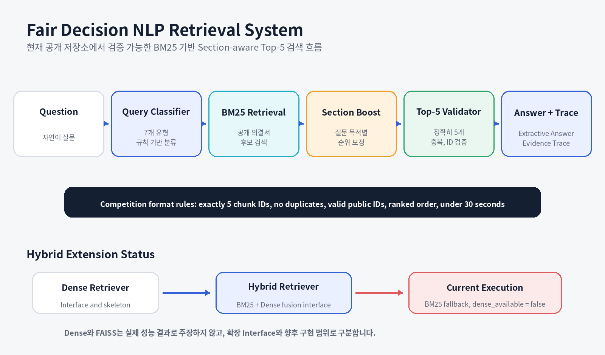
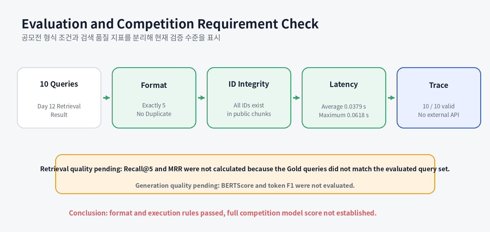

# 공정거래 의결서 NLP 검색

**Section-aware BM25 Retrieval, Query Classification, Top-5 Evidence, and Extractive Answer**

> 공정거래위원회 공개 의결서에서 질문과 관련된 근거 Chunk를 검색하고, 공모전 형식 조건에 맞는 중복 없는 Top-5 `chunk_id`와 Evidence Trace를 반환하는 문서 검색형 NLP 프로젝트입니다.

<p>
  
  
  
  
  
</p>

---

## Why This Project

공정거래 의결서는 사건 개요, 사실관계, 법 위반 판단, 시정명령, 과징금처럼 서로 다른 역할의 내용이 긴 문서 안에 분산되어 있습니다.

단순 키워드 검색만 사용하면 다음 문제가 생길 수 있습니다.

- 질문의 목적과 다른 Section이 상위에 노출될 수 있습니다.
- 유사한 문장이 반복되어 같은 근거가 여러 번 반환될 수 있습니다.
- 검색 결과가 실제 공개 데이터의 어느 Chunk인지 다시 확인하기 어렵습니다.
- 답변 문장과 원문 Evidence의 연결이 불명확할 수 있습니다.

따라서 답변을 먼저 생성하기보다, 질문 목적에 맞는 근거를 찾고 공개 데이터의 `chunk_id`로 추적할 수 있도록 검색 구조를 설계했습니다.

이 프로젝트는 공정거래위원회의 제2회 공정거래 데이터 활용 공모전 Track 2를 목표로 진행한 팀 프로젝트입니다. 공모전은 의결서 Chunking, 임베딩, Hybrid Retrieval, 근거 기반 생성을 목표로 하며, Retrieval과 Generation을 각각 평가합니다.

Official Competition:

```text
https://www.fairdata.go.kr/aic/contestInfo.do?#tab-track-nav3
```

---

## Project Overview

| 항목 | 내용 |
|---|---|
| **기간** | 2026.05 |
| **형태** | 공모전 팀 프로젝트 |
| **대상 문서** | 공정거래위원회 공개 의결서 Chunk Data |
| **목표** | 질문과 관련된 근거를 검색하고 중복 없는 Top-5 `chunk_id`와 Evidence Trace 반환 |
| **현재 검증 Pipeline** | Query Classification, BM25, Section Boost, Top-5 Validation, Extractive Answer, Evidence Trace |
| **확장 Interface** | Dense Retriever, BM25와 Dense Score Fusion, Hybrid Retriever |
| **기술** | Python, pandas, rank-bm25, JSON |
| **핵심 출력** | Query Type, Ranked Top-5 Chunk IDs, Section Type, Score, Extractive Answer, Evidence |
| **주의** | 법률 판단이나 법률 자문을 제공하는 시스템이 아님 |

---

## Team Scope and Contribution

### Overall Team Scope

```text
Public Decision Chunks
→ Preprocessing and Chunk Validation
→ BM25 Retrieval
→ Dense and Hybrid Interface
→ Query Classification
→ Section Boost
→ Top-5 Validation
→ Retrieval Evaluation
→ Extractive Answer and Evidence Trace
```

### Direct Contribution

- 질문 목적을 구분하는 Query Classification 기준 설계
- 질문 유형별 Section 우선순위와 Boost 가중치 설계
- Dense Retrieval Baseline과 Hybrid 연결 구조 검토
- Section Boost와 Top-K 검증 로직 구현
- 정확히 5개, 중복 없음, 공개 데이터 ID 존재 여부 검증
- 검색 결과 수동 평가와 실패 사례 분석
- Gold Evidence 검토와 평가 기준 정리
- Team Lead로 Sprint, 일정, MVP 범위와 통합 상태 관리
- 일정 지연 가능성을 조기에 공유하고 작업 범위를 재분배해 통합 일정 영향 축소

> 전처리와 Chunking, BM25 구현, Score Fusion, 자동 Evaluator, Answer와 Evidence 구조는 팀 전체 범위입니다. 위 항목은 직접 담당하거나 통합 검토한 범위를 구분해 작성했습니다.

---

## Problem → Implementation → Result

| Problem | Implementation | Result |
|---|---|---|
| 긴 의결서에서 관련 단어는 찾지만 질문 목적과 다른 Section이 노출됨 | 규칙 기반 Query Classification과 Section Boost 적용 | 과징금, 법리, 사실관계, 법조항, 시정조치 등 질문 목적에 맞게 순위 보정 |
| 유사한 근거가 반복되어 Top-K가 단조로워짐 | `chunk_id` 기준 중복 제거 | 평가 Query 10개에서 중복 없는 Top-5 반환 |
| 검색 결과의 원문 위치를 추적하기 어려움 | 공개 데이터의 기존 `chunk_id` 유지와 존재 여부 검증 | 10개 Query의 모든 반환 ID가 공개 Chunk Data에 존재 |
| 공모전 형식 조건 위반 시 점수가 0점 처리될 수 있음 | 정확히 5개, 중복 없음, 유효 ID, 30초 이내 검증 | 형식과 실행 조건 10 / 10 통과 |
| 답변이 검색 근거 밖의 내용을 포함할 수 있음 | Top-5 중 최대 3개를 사용하는 Extractive Answer와 Trace Rule | 10개 Query의 Evidence Trace 10 / 10 유효 |
| Dense 검색이 실행 환경에서 준비되지 않을 수 있음 | Hybrid Interface와 BM25 Fallback 구성 | 현재 공개 Artifact는 `hybrid_bm25_fallback`, `dense_available=false`로 실행 |
| 정답 Dataset과 평가 Query가 다르면 품질 점수를 계산할 수 없음 | Recall@5와 MRR 계산 시 Gold Query Mapping 확인 | 현재 Recall@5와 MRR은 미산출로 명시 |

---

## System Overview



### Current Verified Pipeline

| Layer | Responsibility |
|---|---|
| **Query Classifier** | 질문을 `penalty`, `legal_reasoning`, `fact_pattern`, `law_article`, `corrective_order`, `summary`, `general`로 분류 |
| **BM25 Retriever** | 질문 단어와 Chunk Text의 Keyword 일치 기반 후보 검색 |
| **Section Boost** | Query Type에 따라 `penalty`, `order`, `legal_reasoning`, `fact`, `law_article` 등의 Score 보정 |
| **Top-5 Validator** | 정확히 5개 선택, 중복 제거, 공개 데이터 ID 존재 확인 |
| **Extractive Answer** | Top-5 중 최대 3개 Evidence Text를 사용해 보수적인 답변 구성 |
| **Evidence Trace** | 질문, Top-5, Answer, 사용한 Evidence ID와 Trace Rule 연결 |
| **Evaluator** | 형식, 응답 시간, Recall@5와 MRR 계산 구조 제공 |

### Hybrid Scope Clarification

현재 `HybridRetriever`는 BM25와 Dense 결과를 결합할 수 있는 Interface를 제공합니다. 하지만 공개된 Day 12와 Day 13 실행 Artifact에서는 Dense Retriever가 연결되지 않아 BM25 Fallback으로 동작했습니다.

```text
retriever = hybrid_bm25_fallback
dense_available = false
```

따라서 현재 성능을 BM25와 Dense가 모두 동작한 Hybrid Retrieval 결과로 표현하지 않습니다. FAISS와 실제 Dense Index도 완료 결과가 아니라 확장 범위입니다.

---

## Competition Requirement Mapping

공모전 Track 2는 Retrieval과 Generation을 각각 평가하며, Retrieval은 Recall@5와 MRR을 사용합니다. 또한 정확히 5개의 Chunk ID, 중복 금지, 공개 데이터에 존재하는 ID, 30초 이내 응답을 요구합니다.



### Mandatory Format and Runtime Rules

| Official Rule | Project Verification | Status |
|---|---|---|
| 정확히 5개의 `chunk_id` 반환 | 10 / 10 Query가 정확히 5개 반환 | **PASS** |
| 중복 `chunk_id` 금지 | 10 / 10 Query에서 중복 없음 | **PASS** |
| 공개 데이터에 존재하는 ID만 사용 | Day 11 Chunk Validation 10 / 10 통과 | **PASS** |
| 배열 순서를 검색 Ranking으로 사용 | Score 내림차순 Top-5 저장 | **PASS** |
| 응답 시간 30초 이내 | 평균 0.0379초, 최대 0.0618초 | **PASS** |
| 외부 API 호출 금지 | Local Retrieval과 Extractive Answer 사용 | **PASS** |

> 응답 시간은 현재 개발 환경의 10개 Query 실행 결과입니다. 공모전 평가 환경의 처리 시간을 보장하는 수치는 아닙니다.

### Official Quality Metrics

| Metric | Official Role | Current Status |
|---|---|---|
| **Recall@5** | Top-5 안에 정답 Evidence가 포함되는지 평가 | **미산출** |
| **MRR** | 첫 정답 Chunk의 Ranking 평가 | **미산출** |
| **BERTScore** | 생성 답변의 의미적 유사도 평가 | **미산출** |
| **Token F1** | 생성 답변의 Token 수준 일치 평가 | **미산출** |

현재 `qa_eval_set.jsonl`에는 Gold Query 5개가 있지만, Day 12에서 평가한 Query 10개와 문장이 일치하지 않아 `evaluated_with_gold_count=0`입니다. 따라서 형식 조건을 통과했다고 해서 공모전 전체 평가 기준을 충족하거나 높은 Retrieval 점수를 확보했다고 주장하지 않습니다.

---

## Key Results

### Structural and Runtime Evaluation

| Evaluation | Result |
|---|---:|
| Evaluated Queries | **10** |
| Format Passed | **10 / 10** |
| Exactly Five IDs | **10 / 10** |
| No Duplicate IDs | **10 / 10** |
| Valid Public Chunk IDs | **10 / 10** |
| Within 30 Seconds | **10 / 10** |
| Average Elapsed Time | **0.0379 sec** |
| Maximum Elapsed Time | **0.0618 sec** |
| Valid Evidence Trace | **10 / 10** |
| External API | **False** |
| LLM Generation | **False** |
| Answer Mode | `extractive_fallback` |
| Dense Available | **False** |

### Result Interpretation

- 공모전의 형식과 실행 조건을 검증하는 구조는 정상 동작했습니다.
- Answer가 사용하는 Evidence ID는 모두 검색된 Top-5 안에 포함되었습니다.
- 실제 Retrieval 관련성은 Recall@5와 MRR이 산출되지 않아 확정할 수 없습니다.
- Extractive Answer는 첫 번째 검색 결과의 영향을 크게 받기 때문에 검색 실패가 답변 실패로 이어집니다.
- 일부 Query Artifact에서는 질문과 직접 관련되지 않은 Chunk가 상위에 노출되어 Retrieval 개선 필요성을 확인했습니다.

---

## Query Classification and Section Boost

### Query Types

| Query Type | Main Question Purpose | Priority Section Example |
|---|---|---|
| `penalty` | 과징금 금액, 산정, 관련매출액 | `penalty`, `order`, `legal_reasoning` |
| `legal_reasoning` | 위법 판단 이유와 법리 | `legal_reasoning`, `law_article`, `fact` |
| `fact_pattern` | 문제된 행위와 사실관계 | `fact`, `legal_reasoning`, `summary` |
| `law_article` | 적용 법령과 위반 조항 | `law_article`, `legal_reasoning` |
| `corrective_order` | 시정명령, 고발, 처분 결과 | `order`, `conclusion`, `penalty` |
| `summary` | 사건 개요와 핵심 정리 | `summary`, `fact`, `legal_reasoning` |
| `general` | 명확한 유형에 속하지 않는 질문 | `summary`, `fact`, `legal_reasoning` |

### Example

```text
Question: 이 사건 과징금은 얼마야?
Query Type: penalty
Matched Keywords: 과징금, 얼마

Base Score × Section Weight
penalty          × 1.65
order            × 1.30
legal_reasoning  × 1.10
law_article      × 1.05
fact             × 0.90
```

샘플 결과에서는 `penalty` Section Chunk가 Section Boost를 받아 1순위로 이동했습니다.

---

## Retrieval and Answer Pipeline

```text
Public Decision Chunk Data
→ Query Classification
→ BM25 Candidate Retrieval
→ Section Type Normalization
→ Query-aware Section Boost
→ Candidate Ranking
→ Duplicate and ID Validation
→ Ranked Top-5 Chunk IDs
→ Extractive Answer
→ Evidence Trace
→ JSON Artifact
```

### Top-5 Rule

```python
assert len(chunk_ids) == 5
assert len(set(chunk_ids)) == 5
assert all(chunk_id in public_chunk_ids for chunk_id in chunk_ids)
```

### Evidence Trace Rule

```python
answer_uses_only_top5_chunks = True
has_evidence = True
external_api = False
llm_generation = False
```

---

## Technical Details

<details open>
<summary><b>01 | Chunk and Metadata</b></summary>

<br>

검색 단계에서 유지하는 핵심 필드:

```json
{
  "chunk_id": "DOC-...-CH-032",
  "section_type": "legal_reasoning",
  "text": "의결서 원문 구간",
  "doc_id": "DOC-...",
  "title": "의결서 제목",
  "source_file": "원본 파일",
  "page": 14
}
```

최종 `chunk_id`는 공정거래위원회가 제공한 공개 데이터의 ID를 유지해야 합니다.

</details>

<details>
<summary><b>02 | BM25 and Hybrid Interface</b></summary>

<br>

```text
BM25 Results
     +
Optional Dense Results
     ↓
Score Normalization
     ↓
Weighted Fusion
     ↓
Section Boost
     ↓
Top-5 Validation
```

Dense Retriever가 연결되지 않으면 BM25 Weight를 1.0, Dense Weight를 0.0으로 변경해 Fallback합니다.

</details>

<details>
<summary><b>03 | Evaluation</b></summary>

<br>

`src/retrieval/evaluator.py`는 다음 항목을 계산합니다.

```text
Exactly Five
No Duplicate
Within 30 Seconds
Recall@5
MRR
```

Recall@5와 MRR은 Gold Chunk ID가 있는 Query만 계산하며, 정답이 비어 있거나 Query Mapping이 없으면 `None`을 반환합니다.

</details>

<details>
<summary><b>04 | Extractive Answer and Trace</b></summary>

<br>

현재 Answer는 외부 LLM이 아니라 Top-5 중 최대 3개 Chunk의 Text를 사용하는 Extractive Fallback입니다.

```text
Top-5 Results
→ Select up to 3 Evidence Chunks
→ Use First Evidence Text
→ Add Conservative Disclaimer
→ Save Evidence Chunk IDs
```

이 방식은 Evidence 밖의 내용을 생성하지 않는 장점이 있지만, 첫 번째 검색 결과가 부정확하면 Answer도 부정확해지는 한계가 있습니다.

</details>

<details>
<summary><b>05 | Failure Analysis</b></summary>

<br>

| Failure Type | Current Observation | Improvement |
|---|---|---|
| Query와 Gold 불일치 | 평가 Query 10개와 Gold Query 5개가 일치하지 않음 | 동일 Query Key로 Gold Dataset 재작성 |
| Dense 미연결 | Day 12 Artifact에서 `dense_available=false` | Local Embedding과 FAISS Index 구현 |
| Section 과대 보정 | 관련 Keyword가 적어도 특정 Section이 상위로 이동 가능 | Query Type Confidence와 Boost Ablation |
| 유사 Chunk 반복 | ID는 다르지만 문맥이 매우 유사할 수 있음 | Document와 Context 기준 Diversity |
| Extractive Answer 오류 전파 | Rank 1 Chunk가 부정확하면 답변도 부정확 | Re-ranker와 Answer Evidence Selection 개선 |
| 긴 문서 Noise | 표, OCR 단절, 중복 Text가 검색 Score에 영향 | 전처리와 Chunk Quality 검사 강화 |

</details>

---

## Run and Verify

### Environment

```powershell
python -m venv .venv
.\.venv\Scripts\Activate.ps1
python -m pip install -r .\requirements.txt
```

### Build Chunk JSONL

```powershell
python .\scripts\build_chunks_jsonl.py
```

### BM25 Retrieval

```powershell
python .\main.py
```

### Hybrid Interface with BM25 Fallback

```powershell
python .\main_day12_hybrid.py
```

### Evaluation

```powershell
python -m src.retrieval.evaluator
```

### Extractive Answer and Evidence Trace

```powershell
python .\main_day14_answer_trace.py
```

---

## Project Structure

```text
fair-decision-rag/
├── data/
│   ├── processed/
│   │   └── qa_eval_set.jsonl
│   └── chunks.jsonl
├── docs/
├── outputs/
│   └── results/
│       ├── day10_a_sample_result.json
│       ├── day10_bm25_top5.json
│       ├── day11_chunk_validation_report.json
│       ├── day12_hybrid_top5.json
│       ├── day13_eval_report.json
│       └── day14_answer_trace.json
├── scripts/
│   └── build_chunks_jsonl.py
├── src/
│   ├── retrieval/
│   │   ├── answer_generator.py
│   │   ├── bm25_retriever.py
│   │   ├── chunk_validator.py
│   │   ├── evaluator.py
│   │   ├── evidence_trace.py
│   │   ├── hybrid_retriever.py
│   │   ├── query_classifier.py
│   │   ├── score_fusion.py
│   │   ├── section_boost.py
│   │   └── topk_selector.py
│   ├── dense_retriever.py
│   ├── hybrid_retriever.py
│   ├── preprocess.py
│   └── utils.py
├── main.py
├── main_day12_hybrid.py
├── main_day14_answer_trace.py
├── main_hybrid.py
├── requirements.txt
└── README.md
```

---

## Current Scope and Limitations

### Current Scope

- 공정거래위원회 공개 의결서 Chunk Data
- 규칙 기반 Query Classification 7종
- Section Type 정규화와 Query-aware Boost
- BM25 Retrieval
- Hybrid Retriever와 Dense 연결 Interface
- 정확히 5개, 중복 없음, 유효 ID 검증
- 30초 이내 실행 조건 검증
- Extractive Answer와 Evidence Trace
- JSON 결과와 평가 Report 저장
- 외부 API 없는 Local Pipeline

### Limitations

- Dense Retrieval과 FAISS Index가 실제 실행 Pipeline에 연결되지 않음
- 현재 결과는 BM25 Fallback 기반
- Recall@5와 MRR이 산출되지 않음
- Generation의 BERTScore와 Token F1이 산출되지 않음
- Gold Dataset과 Evaluation Query가 일치하지 않음
- Extractive Answer가 Rank 1 오류를 그대로 반영할 수 있음
- 법률 해석과 자문을 제공하지 않음
- User Interface, API, Docker, 자동 Test가 없음
- 실제 공모전 최종 점수나 수상 결과를 의미하지 않음

### Next Steps

1. Evaluation Query와 Gold Chunk ID를 동일 Key로 재구성
2. Recall@5와 MRR Baseline 산출
3. Local Sentence Embedding과 FAISS Index 구현
4. BM25, Dense, Hybrid, Section Boost Ablation 비교
5. Cross-encoder Re-ranking 적용
6. BERTScore와 Token F1 Generation 평가
7. Document와 Section Diversity 기반 Top-K 개선
8. API와 Web Interface 구현
9. Docker Offline 실행 환경 구성
10. 자동 Test와 CI 추가

---

## What This Project Demonstrates

- 긴 공공문서를 Chunk와 Section 단위로 검색하는 NLP 문제 정의 경험
- BM25 Retrieval과 Section-aware Re-ranking 구현 경험
- 규칙 기반 Query Classification과 설명 가능한 검색 정책 설계 경험
- 중복 없는 Top-5와 원문 `chunk_id` 무결성 검증 경험
- 공모전 형식 조건을 코드와 평가 Artifact로 확인한 경험
- Recall@5와 MRR 평가 구조를 구현하고 미산출 원인을 구분한 경험
- Extractive Answer와 Evidence Trace를 연결한 경험
- 검색 실패가 답변 실패로 이어지는 구조를 분석한 경험
- Team Lead로 Sprint, 일정, MVP 범위와 통합을 관리한 경험
- 팀 전체 범위와 직접 기여를 구분해 문서화한 경험

---

## Contact

- Developer: 김수진
- GitHub: https://github.com/lightleaping
- Email: workingskyroad@gmail.com
